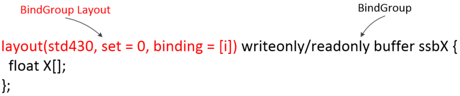

## CPU setup
#### makeBindGroupLayout from shader_preprocessor.InputInfo/output/uniforms info

this.compileAndRun(program, [a, b], output)
```
    const inputsData =
        inputs.map((input: Tensor, i: number) => ({
                     // Returning dtype from tensorMap because it reflects dtype
                     // of underlying buffer, rather than abstract dtype.
                     dtype: this.tensorMap.get(input.dataId).dtype,
                     shape: input.shape,
                     name: program.variableNames[i]
                   }));
   
    const output = Tensor.make(program.outputShape, {}, dtype) as Tensor;

    const uniforms = this.makeUniforms(uniformData);

```

uniforms一般分为两种。programUniforms+dimUniforms。
dimUniforms是根据输入输出tensor的shape信息生成的。
programUniforms则提供了更多参数读取的信息：

dimUniforms的例子：
```
    let dimUniforms: number[] = [];
    const bufferShapes = inputs.concat(output).map(d => d.shape);
    bufferShapes.forEach((d, i) => {
      ...
      for (let p = 0; p < padding; ++p) {
        dimUniforms.push(0);
      }
      dimUniforms.push(...d);
      currentOffset += d.length + padding;
    });
```

programUniforms的例子：
```
    const dimensions = [
      convInfo.filterHeight, convInfo.filterWidth, ...pad,
      convInfo.strideHeight, convInfo.strideWidth
    ];
```

```
const makeBindGroupLayout =
    (device: GPUDevice, inputs: shader_preprocessor.InputInfo[], output: Tensor,
     uniforms?: BindingInfo): GPUBindGroupLayout => {
      const bindings = Array(1 + inputs.length).fill({
        visibility: GPUShaderStage.COMPUTE,
        type: 'storage-buffer' as GPUBindingType
      });
      if (uniforms) {
        bindings.push({
          visibility: GPUShaderStage.COMPUTE,
          type: 'uniform-buffer' as GPUBindingType
        });
      }
      return device.createBindGroupLayout({
        bindings: bindings.map((b, i) => ({binding: i, ...b})),
      });
    };
```

Shader's layout code:
```
layout(std430, set = 0, binding = 0) 
layout(std430, set = 0, binding = 1)
layout(std430, set = 0, binding = 2)
layout(std430, set = 0, binding = 3)
```

#### makeBindGroup from BindingInfo/output/uniforms info

```
export const makeBindGroup =
    (device: GPUDevice, bindGroupLayout: GPUBindGroupLayout,
     inputs: BindingInfo[], output: BindingInfo, uniforms?: BindingInfo) => {
      const bindings = [output, ...inputs];
      if (uniforms) {
        bindings.push(uniforms);
      }
      return device.createBindGroup({
        layout: bindGroupLayout,
        bindings: bindings.map((b, i) => ({binding: i, resource: b.resource})),
      });
    };
```
Shader's bind code:
```
buffer ssbOut
buffer ssbA
buffer ssbB
uniform Uniforms
```

## Input/output layout/bind group generator





输出是固定的binding 0：
```
  // Output buffer.
  prefixSnippets.push(`
    layout(std430, set = 0, binding = 0) writeonly buffer ssbOut {
      ${mapToGlslTypes(outputData.dtype)} result[];
    };
  `);
```

输入则分为多个情况：原始数据存储在GPUBuffer, Uniforms也存储在GPUBuffer。

下面这个是针对原始数据的：
```
  let uniformDeclaration = '';
  program.variableNames.forEach((x, i) => {
    uniformDeclaration += `${getCoordsDataType(inputInfo[i].shape.length)} ${
        x.charAt(0).toLowerCase() + x.slice(1)}Shape; `;
    prefixSnippets.push(`
      layout(std430, set = 0, binding = ${1 + i}) readonly buffer ssb${x} {
        ${mapToGlslTypes(inputInfo[i].dtype)} ${x}[];
      };
    `);
  });
```
下面这个是针对Uniforms，Uniforms其实是原始数据的布局和尺寸等信息：
```
  prefixSnippets.push(`
    layout(std140, set = 0, binding = ${
      1 + program.variableNames.length}) uniform Uniforms {
      ${uniformDeclaration}
    };
  `);
```

相对应生成的着色器代码是（以greater为例子）：
```
  // Output
  layout(std430, set = 0, binding = 0) writeonly buffer ssbOut {
    float result[];
  };

  // Input GPUBuffer
  layout(std430, set = 0, binding = 1) readonly buffer ssbA {
    float A[];
  };
  // Input GPUBuffer 
  layout(std430, set = 0, binding = 2) readonly buffer ssbB {
    float B[];
  };

  // Input  Uniforms  
  layout(std140, set = 0, binding = 3) uniform Uniforms {
    ivec2 aShape; ivec2 bShape; ivec2 outShape; 
  };
```


## Input/output read/write 


```
void setOutput(uint flatIndex, float value) {
  result[flatIndex] = bool(value);
}

float getA(int d0, int d1) {
  return A[getFlatIndex(ivec2(d0,d1),
    aShape)];
}

float getAAtOutCoords() {
  ivec2 coords = getOutputCoords();
  
  return A[getFlatIndex(ivec2(coords[0], coords[1]), aShape)];
}

float getAAtOutCoords(ivec2 coords) { 
  return A[getFlatIndex(ivec2(coords[0], coords[1]), aShape)];
}

float getB(int d0, int d1) {
  return B[getFlatIndex(ivec2(d0,d1),
    bShape)];
}

float getBAtOutCoords() {
  ivec2 coords = getOutputCoords();
  
  return B[getFlatIndex(ivec2(coords[0], coords[1]), bShape)];
}

```
