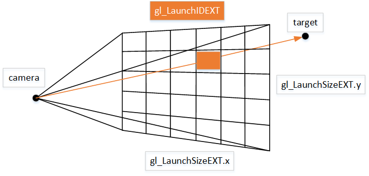

## Pipeline


Add two stages in:
```
typedef enum VkPipelineStageFlagBits {
  // Provided by VK_KHR_acceleration_structure
    VK_PIPELINE_STAGE_ACCELERATION_STRUCTURE_BUILD_BIT_KHR = 0x02000000,
  // Provided by VK_KHR_ray_tracing_pipeline
    VK_PIPELINE_STAGE_RAY_TRACING_SHADER_BIT_KHR = 0x00200000,
}
```


## Acceleration Structure

The API defines two types of operations to produce acceleration structures from geometry:

- A build operation is used to construct an acceleration structure.
- An update operation is used to modify an existing acceleration structure.

BVH可以由GPU构建，也可以由CPU构建：
- VkCmdBuildAccelerationStructureKHR()
- VkCmdBuildAccelerationStructureIndirectKHR()
- VkBuildAccelerationStructureKHR() (for CPU builds)


Use Case: Load Balancing

Host acceleration structure builds provide opportunities to improve performance by leveraging otherwise idle CPUs. Consider a hypothetical profile from a game:


Figure 5: Load balancing: No Host Build

In Figure 5, acceleration structure construction and updates are implemented on the device, but the application has considerable CPU time to spare. Moving these operations to the host allows the CPU to execute the next frame’s acceleration structure work in parallel with the previous frame’s rendering. This can improve throughput, even if the CPU requires more wall-clock time to perform the same task, as shown in Figure 6.


Figure 6: Load Balancing: Host Build Enabled

## Shader

Any hit shaders are useful, for instance, when geometry has transparency


*D3D*


*Vulkan*


## Understand how manys rays will be generated

```
void vkCmdTraceRaysKHR(
    VkCommandBuffer                             commandBuffer,
    const VkStridedDeviceAddressRegionKHR*      pRaygenShaderBindingTable,
    const VkStridedDeviceAddressRegionKHR*      pMissShaderBindingTable,
    const VkStridedDeviceAddressRegionKHR*      pHitShaderBindingTable,
    const VkStridedDeviceAddressRegionKHR*      pCallableShaderBindingTable,
    uint32_t                                    width, // gl_LaunchSizeEXT.x
    uint32_t                                    height, // gl_LaunchSizeEXT.y
    uint32_t                                    depth);
```



*Vulkan*


## Reference

Raytracing: 

https://www.khronos.org/blog/ray-tracing-in-vulkan

https://xdc2020.x.org/event/9/contributions/613/attachments/715/1318/Ray-tracing_in_Vulkan.pdf

https://vulkan.lunarg.com/doc/view/1.2.162.0/mac/chunked_spec/chap39.html

D3D Raytracing:

https://microsoft.github.io/DirectX-Specs/d3d/Raytracing.html#traceray-control-flow
