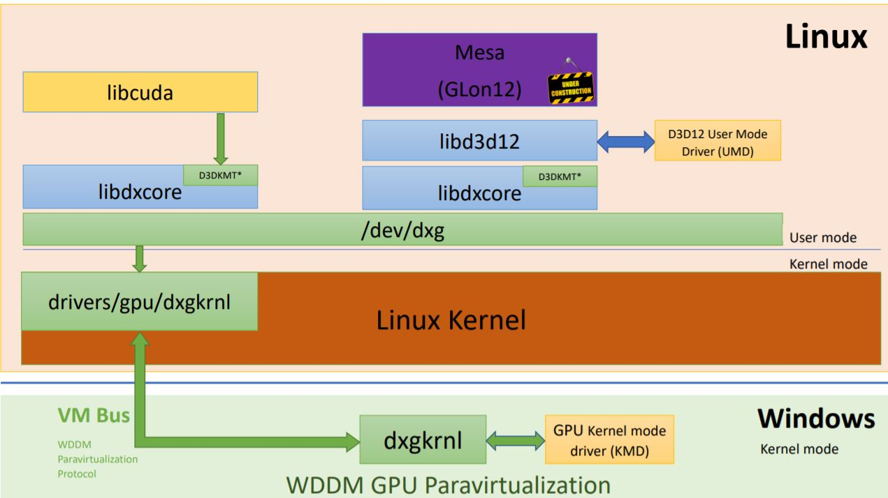

Graphics Architecture on Windows Subsystem for Linux 
https://xdc2020.x.org/event/9/contributions/610/attachments/700/1295/XDC_-_WSL_Graphics_Architecture.pdf

Linux子系统其实就是一个完全独立的运行在windows上的虚拟机。
VM提供了虚拟的显存和虚拟的GPU供Linux子系统使用。
