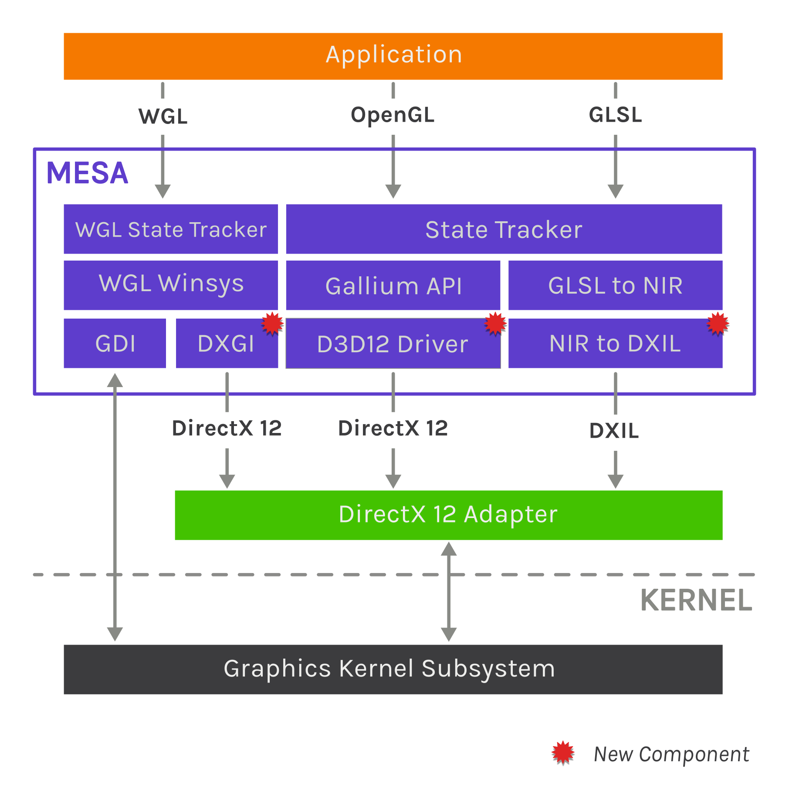

## OpenGL over D3D

https://www.collabora.com/news-and-blog/blog/2020/07/09/deep-dive-into-opengl-over-directx-layering/

DXIL: compiled shaders (DXIL bytecode). DXIL is essentially LLVM 3.7 bitcode with some extra metadata and validation.
NIR: Mesa will also translate GLSL shaders into an intermediate representation named NIR.

## Graphics Architecture on Windows Subsystem for Linux 
https://xdc2020.x.org/event/9/contributions/610/attachments/700/1295/XDC_-_WSL_Graphics_Architecture.pdf

Linux子系统其实就是一个完全独立的运行在windows上的虚拟机。
VM提供了虚拟的显存和虚拟的GPU供Linux子系统使用。

## Allocation_Constraints

https://xdc2020.x.org/event/9/contributions/615/attachments/704/1301/XDC_2020__Allocation_Constraints.pdf

## Vulkan Presentation Timing

https://xdc2020.x.org/event/9/contributions/867/attachments/706/1304/XDC_2020__Vulkan_Presentation_Timing.pdf
https://www.khronos.org/registry/vulkan/specs/1.2-extensions/man/html/VK_GOOGLE_display_timing.html