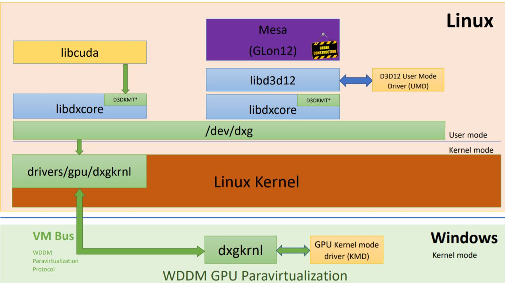

## OpenGL over D3D

https://www.collabora.com/news-and-blog/blog/2020/07/09/deep-dive-into-opengl-over-directx-layering/

DXIL: compiled shaders (DXIL bytecode). DXIL is essentially LLVM 3.7 bitcode with some extra metadata and validation.
NIR: Mesa will also translate GLSL shaders into an intermediate representation named NIR.

## Graphics Architecture on Windows Subsystem for Linux 
https://xdc2020.x.org/event/9/contributions/610/attachments/700/1295/XDC_-_WSL_Graphics_Architecture.pdf

Linux子系统其实就是一个完全独立的运行在windows上的虚拟机。
VM提供了虚拟的显存和虚拟的GPU供Linux子系统使用。

如果将OpenGL over D3D和Graphics Architecture on Windows Subsystem for Linux， 就可以一窥整个Windows Graphics for Linux的大概：

## Allocation_Constraints

https://xdc2020.x.org/event/9/contributions/615/attachments/704/1301/XDC_2020__Allocation_Constraints.pdf

## Vulkan Presentation Timing

https://xdc2020.x.org/event/9/contributions/867/attachments/706/1304/XDC_2020__Vulkan_Presentation_Timing.pdf
https://www.khronos.org/registry/vulkan/specs/1.2-extensions/man/html/VK_GOOGLE_display_timing.html

## About OpenGL and Vulkan interoperability
EXT_external_objects(_fd) extensions enable:
- Allocation of resources (textures, buffers) from Vulkan and sharing
of those resources from both APIs
- Synchronization of the access to shared resources between APIs.
- Example: a VR compositor where the left and right eye images are allocated and
displayed by Vulkan but their contents are filled by OpenGL processes.

Linux extension:
EXT_external_objects_fd (EXT_memory_object_fd, EXT_semaphore_fd):
- enables an OpenGL application to import a memory object or semaphore
from POSIX file descriptor external handles

EXT_external_objects (EXT_memory_object, EXT_semaphore):
- enables an OpenGL application to create OpenGL objects corresponding to
Vulkan objects (textures, buffers, semaphores) and synchronize access to
shared objects across APIs
- extends existing GL calls that set and query properties

Reference:
https://xdc2020.x.org/event/9/contributions/620/attachments/696/1308/estea-xdc2020.pdf

## Accelerating ray-tracing with the Vulkan API
Ray-tracing in Vulkan has two primary parts:
Acceleration structures
- Hold all of the geometry for your entire scene
- Allow acceleration of arbitrary ray geometry intersections

Six new shader stages
- Dispatch rays, handle hits and misses, and define procedural geometry
- Lots of new system-values and intrinsics

https://xdc2020.x.org/event/9/contributions/613/attachments/715/1318/Ray-tracing_in_Vulkan.pdf

## How the vulkan VK_EXT_extended_dynamic_state extension came to be

VK_EXT_extended_dynamic_state

https://xdc2020.x.org/event/9/contributions/627/attachments/717/1320/How-the-Vulkan-VK_EXT_extended_dynamic_state-extension-came-to-be-final.pdf